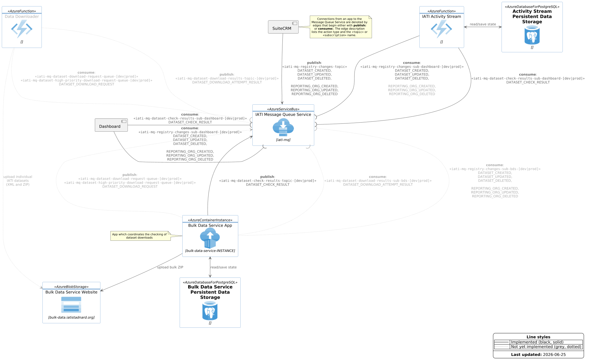

# IATI Message Queue Service

## Summary

| Product          | IATI Message Queue Service |
| ---------------- | --------------------------------- |
| Description      | The specification for the internal message queue service that is used by several IATI products to communicate with each other |
| Website          | n/a  |
| Related          | [IATI Registry SuiteCRM Extension](https://github.com/IATI/iati-registry-suitecrm-extension)|
| Documentation    | This README and the docs it links to below |
| Technical Issues | See https://github.com/IATI/iati-message-queue-service/issues |
| Support          | https://iatistandard.org/en/guidance/get-support/  |

## Overview diagram

The IATI Message Queue Service is an instance of the Azure Service Bus messaging
platform. It is provisioned and configured using the IATI OpenTofu setup.

The component overview diagram below shows which internal IATI components
communicate with each other using the IATI Message Queue Service, as well as the
message types they send or receive:



This diagram is generated from the following PlantUML file
[iati-message-queue-service-and-apps-overview](docs/iati-message-queue-service-and-apps-overview.puml).


## Specifications

Proposed/draft specifications for the various application interfaces to the IATI
message queue/service bus that facilitates internal communication between IATI
apps, specifically the CRM/Registry, Dashboard, Bulk Data Service, and Data
Downloader. For each service interface there is an
[AsyncAPI](https://www.asyncapi.com/en) specification written in YAML.


* IATI Registry Messaging Spec: [YAML](./specification/iati-registry.yaml),
  [Rendered
  HTML](https://htmlpreview.github.io/?https://github.com/IATI/iati-message-queue-service/blob/develop/docs/spec-iati-registry/index.html)
  (external preview tool).

* IATI Dashboard Messaging Spec:
  [YAML](./specification/iati-dashboard.yaml), [Rendered
  HTML](https://htmlpreview.github.io/?https://github.com/IATI/iati-message-queue-service/blob/develop/docs/spec-iati-dashboard/index.html)
  (external preview tool).

* IATI Bulk Data Service Messaging Spec:
  [YAML](./specification/iati-bulk-data-service.yaml), [Rendered
  HTML](https://htmlpreview.github.io/?https://github.com/IATI/iati-message-queue-service/blob/develop/docs/spec-iati-bulk-data-service/index.html)
  (external preview tool).

* IATI Data Downloader Messaging Spec:
  [YAML](./specification/iati-data-downloader.yaml), [Rendered
  HTML](https://htmlpreview.github.io/?https://github.com/IATI/iati-message-queue-service/blob/develop/docs/spec-iati-data-downloader/index.html)
  (external preview tool).


## Sample Python apps

README For the [sample Python apps](sample-python-apps/README.md)

## Updating the spec

The YAML files are the canonical copy of the spec.

There is a CI job which runs `yamllint` on the YAML files and PRs will fail
checks if the linting fails.

The relevant `yamllint` command to run to check the files is:

```bash
yamllint .
```

If you don't have `yamllint` installed globally, you can install it for just
this repo using pip which will make the `yamllint` cli available:

```bash
python -m venv .ve
source .ve/bin/activate
pip install yamllint
```

The documentation is autogenerated with the `asyncapi` program. This can be done
locally using the `generate-html.sh` script (you need to install the `asyncapi`
cli first), but doesn't need to be, because the autogenerated HTML docs are
autogenerated with a GitHub Actions workflow whenever a change to one of the
specification files is pushed.


### Updating versions

Note: we keep the version numbers for all files in sync, so any change to even just a single file requires bumping the version number in all the YAML file.

## Updating the HTML and Overview Diagram

The rendered HTML specs and the PNG of the overview diagram are both created as
part of the CD job on merge.
